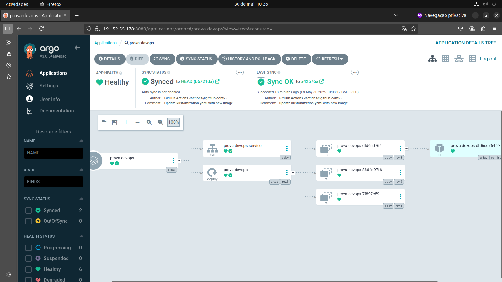

# Atividade de Fundamentos de Devops

>Descrição da Atividade

Nesta avaliação prática, você receberá um projeto simples em FastAPI com três testes já
implementados: dois deles estão passando e um deles está falhando devido a um erro
proposital na implementação da aplicação. O objetivo é aplicar os conhecimentos adquiridos
sobre:

- Git e GitHub
- Testes automatizados com pytest
- Commits semânticos
- CI/CD com GitHub Actions
- Docker e DockerHub
- Kubernetes com Kind
- Kustomize
- ArgoCD

```python 
# arquivo main.py
from fastapi import FastAPI

app = FastAPI()

@app.get("/")
def read_root():
    return {"message": "Hello World"}

@app.get("/square/{x}")
def square(x: int):
    return {"result": x + x}

@app.get("/double/{x}")
def double(x: int):
    return {"result": x * 2}
```
```python
# arquivo test_main.py
from fastapi.testclient import TestClient
from main import app

client = TestClient(app)

def test_read_root():
    response = client.get("/")
    assert response.status_code == 200
    assert response.json() == {"message": "Hello World"}

def test_square():
    response = client.get("/square/3")
    assert response.status_code == 200
    assert response.json() == {"result": 9}

def test_double():
    response = client.get("/double/4")
    assert response.status_code == 200
    assert response.json() == {"result": 8}

```
>Dicas importantes

Não esqueça que você precisa criar um ambiente virtual python com, pelo menos, os
seguintes pacotes:
- fastapi
- uvicorn
- pytest
- httpx

>Instruções
1. Criar um repositório GitHub e clonar localmente.
2. Executar os testes com pytest e corrigir o erro na aplicação.
3. Fazer commits semânticos para cada alteração.
4. Criar um workflow GitHub Actions que:
○ Execute os testes com pytest.
○ Crie uma imagem Docker e publique no DockerHub.
5. Criar configuração de Deployment e Service no Kubernetes, usando Kustomize.
6. Ajustar o workflow de CI/CD para:
○ Atualizar o kustomization.yaml com a imagem gerada e versão.
○ Fazer commit e push automático da alteração.
7. Configurar um cluster local com Kind, com 3 nodes (sendo um control-plane).
8. Instalar e configurar o ArgoCD.
9. Criar um App no ArgoCD apontando para seu repositório e diretório de
configurações Kubernetes.
10. Fazer a sincronização via ArgoCD e testar a aplicação com kubectl
port-forward.
11. Fazer uma alteração no FastAPI, realizar o push e verificar se o ArgoCD detecta e
sincroniza corretamente.

## Instalação do projeto

Crie um ambiente virtual

```bash
python3 -m venv .venv
```

Ative o ambiente virtual (Linux / WSL 2 / MacOS)

```bash
source .venv/bin/activate
```

Instale as dependências

```bash
cd app
pip install -r requirements.txt
```

## Rodar o projeto

```bash
python3 main.py
```

## Testar o projeto

```bash
pytest test_main.py
```

### Instação do ArgoCD
```bash
kubectl create namespace argocd
kubectl apply -n argocd -f https://raw.githubusercontent.com/argoproj/argo-cd/stable/manifests/install.yaml
```

### Port-Forward
```bash
kubectl port-forward svc/argocd-server -n argocd --address 0.0.0.0 8080:443
```

Isso fará o encaminhamento da porta 8080 do seu computador local para a porta 443 do serviço ```argocd-server``` no namespace ```argocd```.

```bash
kubectl get secret argocd-initial-admin-secret -n argocd -o jsonpath="{.data.password}" | base64 -d; echo
```

Finalizada essa parte, você pode acessar o ArgoCD em ```https://localhost:8080```. O nome de usuário padrão é ```admin``` e a senha pode ser obtida com o seguinte comando:

> ## Etapas feitas 
 Todas

### ArgoCD rodando localmente:
